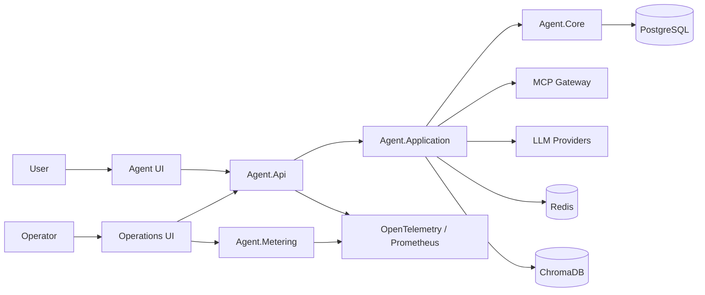

# AgentProject

> A modular AI-agent platform built with .NET 8 and React 19 for LLM orchestration, retrieval-augmented generation, workflow automation, tool integration, and operational telemetry.

[简体中文](./README.zh_CN.md) · [Build](#build-from-source) · [Configuration](#configuration) · [Run locally](#run-locally) · [Documentation](#documentation)

> [!IMPORTANT]
> AgentProject is under active development. The primary applications build successfully, but several integrations and deployment assets require environment-specific services and credentials. Validate the relevant configuration before production use.

## Why AgentProject

- **Agent orchestration:** workflows, planning, memory, prompts, tool selection, and SignalR updates.
- **LLM and RAG:** Microsoft Semantic Kernel, multiple provider configurations, embeddings, and ChromaDB.
- **Extensible tooling:** MCP clients, a tool registry, sandbox terminal integration, and Python utilities.
- **Operations:** metering, rate limiting, OpenTelemetry, Prometheus, Hangfire, Redis, and eBPF-oriented services.
- **Deployment assets:** Docker, Kubernetes, Helm, monitoring, and CI/CD examples kept alongside the applications.

## Architecture



The repository is layered rather than packaged as a single executable. The Docker Compose file under `infra/docker` currently provisions supporting infrastructure; it is not a complete API-and-UI stack.

## Component map

| Component | Build target | Responsibility |
| --- | --- | --- |
| [Agent API](./apps/agent-api/Agent.Api) | `Agent.Api.csproj` | HTTP API, authentication, workflows, RAG, SignalR, MCP, and Semantic Kernel |
| [Application layer](./apps/agent-api/Agent.Application) | Referenced by Agent API | Application services, orchestration, memory, prompts, and tools |
| [Core layer](./apps/agent-api/Agent.Core) | Referenced by both APIs | Domain models, persistence, identity, authorization, and shared abstractions |
| [MCP gateway](./apps/agent-api/Agent.McpGateway) | Referenced by Agent API | MCP client abstractions and external tool adapters |
| [Agent UI](./apps/agent-ui) | `pnpm run build` | Main React agent experience |
| [Operations API](./apps/agent-ops/Agent.Metering) | `Agent.Metering.csproj` | Metering, rate limiting, telemetry, and eBPF-oriented APIs |
| [Operations UI](./apps/agent-ops-ui) | `pnpm run build` | Operations and MLOps dashboard |
| [Agent tools](./apps/agent-tools) | Python utilities | RAG, LangChain, and model examples |
| [Infrastructure](./infra) | Environment-specific | Docker, Kubernetes, Helm, monitoring, and CI/CD assets |
| [LLM utilities](./llm) | Environment-specific | Model serving and fine-tuning examples |

## Technology

| Area | Main technologies |
| --- | --- |
| Backend | .NET 8, ASP.NET Core, Entity Framework Core, Autofac |
| Frontend | React 19, TypeScript 5, Vite 6, pnpm 10 |
| AI | Semantic Kernel, Model Context Protocol, OpenAI/Azure OpenAI configuration |
| Data | PostgreSQL, Redis, ChromaDB |
| Operations | OpenTelemetry, Prometheus, Grafana, Jaeger, Hangfire |
| Deployment | Docker, Kubernetes, Helm, Nginx, YARP |

## Build from source

These commands restore, type-check, and compile the primary applications. They do not start business services or connect to PostgreSQL, Redis, ChromaDB, or an LLM provider.

### Prerequisites

- .NET SDK 8.0 or newer with .NET 8 targeting support
- Node.js 22.12 or newer
- Corepack; both frontend projects pin pnpm 10.33.0
- Git with SSH access to GitHub when cloning over SSH

### Clone

```bash
git clone git@github.com:DrDrZ95/AgentProject.git
cd AgentProject
```

### Build the backend

Run from the repository root:

```bash
dotnet build apps/agent-api/Agent.Api/Agent.Api.csproj --configuration Release
dotnet build apps/agent-ops/Agent.Metering/Agent.Metering.csproj --configuration Release
```

### Build the frontends

The `--dir` form keeps every command runnable from the repository root:

```bash
corepack enable

pnpm --dir apps/agent-ui install --frozen-lockfile
pnpm --dir apps/agent-ui run lint
pnpm --dir apps/agent-ui run build

pnpm --dir apps/agent-ops-ui install --frozen-lockfile
pnpm --dir apps/agent-ops-ui run lint
pnpm --dir apps/agent-ops-ui run build
```

Production frontend assets are written to each application's `dist/` directory.

## Configuration

Never commit credentials. Use .NET User Secrets, environment variables, or the secret manager provided by the deployment platform. ASP.NET Core maps double underscores in environment variables to configuration sections.

### Required server settings

| Environment variable | Required for | Description |
| --- | --- | --- |
| `ConnectionStrings__DefaultConnection` | Agent API startup | PostgreSQL connection string |
| `JwtSettings__SecretKey` | Agent API startup | JWT signing key containing at least 32 bytes |

### Choose one LLM provider

| Provider | Environment variables |
| --- | --- |
| OpenAI | `SemanticKernel__OpenAIApiKey` |
| Azure OpenAI | `SemanticKernel__AzureOpenAIEndpoint`, `SemanticKernel__AzureOpenAIApiKey`, `SemanticKernel__AzureChatDeploymentName`, `SemanticKernel__AzureEmbeddingDeploymentName` |

For OpenAI, model names can be overridden with `SemanticKernel__ChatModel` and `SemanticKernel__EmbeddingModel`. Azure OpenAI uses the deployment-name settings shown above and falls back to those model settings when deployment names are omitted.

Supporting service endpoints have local defaults and can be overridden when needed:

| Environment variable | Default |
| --- | --- |
| `ConnectionStrings__ChromaDbConnection` | `http://localhost:8000` |
| `Redis__ConnectionString` | `localhost:6379` |
| `OpenTelemetry__ExporterEndpoint` | `http://localhost:4317` |

### Optional administrator seed

Default administrator creation is disabled. To opt in, provide all three values externally:

```text
Identity__SeedAdmin__Enabled=true
Identity__SeedAdmin__Email=admin@example.com
Identity__SeedAdmin__Password=<strong password>
```

### Browser configuration

Vite variables are public build-time values. Never store API keys or other secrets in `VITE_*` variables.

| Variable | Used by | Example |
| --- | --- | --- |
| `VITE_API_BASE_URL` | Both frontends; Agent API or gateway base | `http://localhost:5069/api/v1` |
| `VITE_RPC_URL` | Operations UI's optional RPC client | Deployment-specific RPC endpoint |

Set these in the relevant frontend's `.env.local` or through the build environment. `Agent.Metering` listens on port 5090 during development and is not automatically multiplexed with `Agent.Api`; use an appropriate gateway when one frontend must reach both APIs. Provider credentials remain in `Agent.Api` and are not embedded into browser bundles.

## Run locally

Running the applications requires the configuration and external dependencies described above.

| Application | Command | Default development URLs |
| --- | --- | --- |
| Agent API | `dotnet run --project apps/agent-api/Agent.Api/Agent.Api.csproj` | `http://localhost:5069`, `https://localhost:7185` |
| Operations API | `dotnet run --project apps/agent-ops/Agent.Metering/Agent.Metering.csproj` | `http://localhost:5090`, `https://localhost:7088` |
| Agent UI | `pnpm --dir apps/agent-ui run dev` | `http://127.0.0.1:3000` |
| Operations UI | `pnpm --dir apps/agent-ops-ui run dev -- --port 3001` | `http://127.0.0.1:3001` |

Both Vite applications default to port 3000, so the example assigns port 3001 to the Operations UI when they run together. Route frontend API traffic through the backend or gateway appropriate to your environment.

## Security defaults

- Sandbox terminal endpoints require the `system.admin` permission.
- Sandbox system information does not expose host environment variables.
- Hangfire Dashboard is restricted to authenticated users in the `Administrator` role.
- JWT signing keys and database credentials have no source-controlled fallback.
- Default administrator creation is opt-in and requires externally supplied credentials.
- Vite does not inject LLM provider keys into client JavaScript.

> [!WARNING]
> The sandbox terminal executes commands in its host process. Deploy it only inside an appropriately isolated environment and grant `system.admin` sparingly.

## Infrastructure and deployment

[The main Docker Compose file](./infra/docker/docker-compose.yml) provisions PostgreSQL, Redis, ChromaDB, Prometheus, Grafana, Jaeger, and Nginx. Docker, Kubernetes, and Helm assets are environment-specific templates and must be reviewed before production use.

The application services are not currently included in that Compose topology. Build and deploy the API and UI separately, or adapt the templates for your target environment.

## Documentation

### Core platform

- [API documentation](./docs/api_documentation.md)
- [Workflow integration](./docs/workflow_integration.md)
- [Semantic Kernel examples](./docs/semantic_kernel_examples.md)
- [Sandbox terminal integration](./docs/sandbox_terminal_integration.md)
- [Identity and SignalR integration](./docs/identity_signalr_integration.md)
- [MCP integration guide](./docs/mcp_integration_guide.zh_CN.md)

### Data and models

- [ChromaDB integration](./docs/chromadb_integration.md)
- [RAG prompt engineering](./docs/rag_prompt_engineering.md)
- [Prompt engineering practices](./docs/prompt-engineering-best-practices.md)
- [vLLM integration](./docs/vllm_integration.md)
- [Unsloth LoRA fine-tuning](./docs/unsloth_lora_finetuning.md)

### Operations and deployment

- [Environment setup](./docs/environment_setup.md)
- [Docker quick start](./docs/docker_quickstart.md)
- [Helm installation](./docs/helm_installation.md)
- [Prometheus integration](./docs/prometheus_integration.md)
- [Grafana integration](./docs/grafana_integration.md)
- [SSH setup](./docs/ssh_setup.md)

## Development guidelines

- Keep changes scoped to the owning application or architecture layer.
- Update and commit the corresponding `pnpm-lock.yaml` whenever frontend dependencies change.
- Keep secrets out of source control and all `VITE_*` variables.
- Build each affected backend or frontend target before submitting changes.
- Treat integration tests separately from the source build because some require external services.

## License

This repository does not currently include a license file. Unless the owner adds one, standard copyright restrictions apply.
